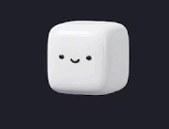

# cute-cube

Framework-agnostic sprite character with named animation states, built on [PixiJS](https://pixijs.com/). Optional Vue 3 and React bindings are published as subpath exports.

## Preview



## Install

Install `cute-cube` and its required peer dependency `pixi.js`. Add Vue or React only if you use those bindings.

### npm

```bash
npm install cute-cube pixi.js
```

Optional peers:

```bash
npm install cute-cube pixi.js vue
# or
npm install cute-cube pixi.js react react-dom
```

### Yarn (Classic / Berry)

```bash
yarn add cute-cube pixi.js
```

Optional peers:

```bash
yarn add cute-cube pixi.js vue
# or
yarn add cute-cube pixi.js react react-dom
```

### pnpm

```bash
pnpm add cute-cube pixi.js
```

Optional peers:

```bash
pnpm add cute-cube pixi.js vue
# or
pnpm add cute-cube pixi.js react react-dom
```

### Bun

```bash
bun add cute-cube pixi.js
```

Optional peers:

```bash
bun add cute-cube pixi.js vue
# or
bun add cute-cube pixi.js react react-dom
```

## Usage

Core API:

```ts
import { CharacterPlayer, createDefaultManifest } from "cute-cube";
```

Vue (`CharacterView` component):

```ts
import { CharacterView } from "cute-cube/vue";
```

React (`CharacterView` component):

```ts
import { CharacterView } from "cute-cube/react";
```

See `src/index.ts` and the `demo/` app for concrete examples.